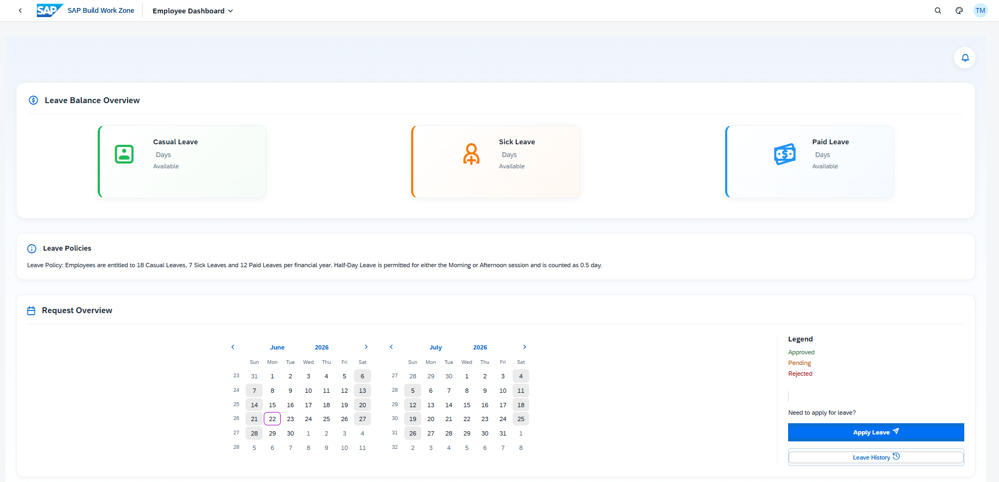
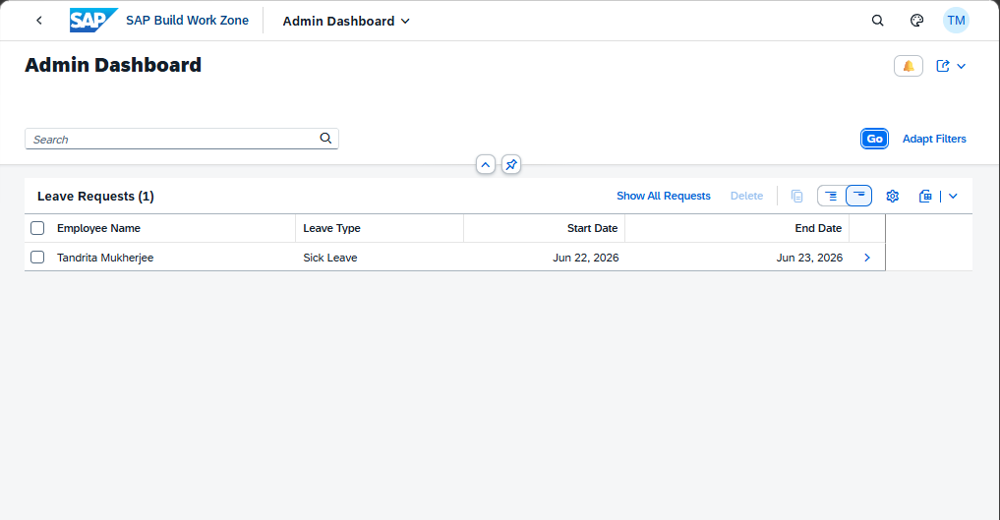

# Leave Management System - SAP BTP Attendance & Channel Operations

An enterprise-grade cloud application developed during my internship at **Infocus Technologies, Kolkata**. This project leverages the **SAP Business Technology Platform (BTP)** to streamline channel management operations and employee tracking. It marks my first hands-on experience building full-stack cloud applications within the SAP ecosystem, utilizing modern development paradigms like the **SAP Cloud Application Programming (CAP) Model**.

---

## 🚀 Project Overview

The **Channel Manager** application is designed to bridge the gap between administrative oversight and employee workflows. It provides a robust platform for managing channel allocations, tracking operational metrics, and handling day-to-day attendance management. 

### Key Features
*   **Role-Based Access Control (RBAC):** Distinct interfaces and permissions for standard Employees and Administrators.
*   **Automated Attendance Tracking:** Seamless logging and state management for employee shifts.
*   **Dynamic Channel Assignment:** Real-time visibility into channel allocations and operations.
*   **Fiori Elements & UI5 User Experience:** Intuitive, responsive enterprise interfaces built using modern SAP frontend libraries.

---

## 🛠️ Tech Stack & Architecture

The application is built on a modern, decoupled cloud architecture:

*   **Cloud Platform:** SAP Business Technology Platform (BTP)
*   **Backend Framework:** SAP Cloud Application Programming (CAP) Model (Node.js/JavaScript)
*   **Data Modeling & Services:** Core Data Services (CDS)
*   **Database:** SAP HANA Cloud / SQLite (for local development)
*   **Frontend Framework:** SAPUI5 & SAP Fiori Elements

---

## 📸 Application Walkthrough & Screenshots

### 1. Employee Dashboard
The employee view focuses on simplicity, allowing quick attendance logging, profile management, and daily task or channel visibility.

> 🖼️ **Employee Page:**
> `

### 2. Admin Portal
The administrative interface provides a bird's-eye view of all system data, allowing managers to view robust data grids, manage user roles, update channel settings, and analyze logs.

> 🖼️ **Admin Page:**
> `

> 🎥 **[Watch the Live Demo Video on YouTube](https://youtu.be/CfUghhclJds)**

---

## 🧠 Challenges Faced & Key Learnings

As this was my first time working in the SAP environment, the project presented an intense but highly rewarding learning curve. 

### 1. The Power of CAP and CDS
Learning **Core Data Services (CDS)** was a fascinating paradigm shift. Defining data models and services declaratively using `.cds` files made backend creation incredibly fast. Understanding how CAP automatically spins up robust CRUD OData V4 services from text definitions was a massive highlight of this project.

### 2. UI5 and Fiori Elements Integration (The "Undefined" Hurdle)
*   **The Problem:** One of the most significant challenges occurred during UI5 component initialization. I encountered frustrating console runtime crashes such as:
    `TypeError: Cannot read properties of undefined (reading 'binding') at c.updateAggregation`.
*   **The Resolution:** This forced me to dig deep into the `manifest.json` configuration and learn the intricate mechanics of **SAP Fiori Elements** and `sap.fe.core.AppComponent`. I discovered that Fiori Elements automatically handles bindings under the hood, meaning any slight case-sensitivity mismatch or missing entity set definition inside the `routing.targets` layout options would break the core rendering aggregation. Resolving this required strict alignment between the OData service metadata and the manifest configurations.

### 3. Database Deployment & Entity Binding
*   **The Problem:** Transitioning from local mock data to real database deployment caused initialization and entity schema mismatches, particularly when attempting to update bound aggregations live.
*   **The Resolution:** I mastered the usage of `cds deploy`, writing correct structural mappings, and managing persistent database states. Troubleshooting these database layer issues taught me how SAP UI layers tightly couple with OData entity sets.

---

## ⚙️ Local Development Setup

To run this project locally, follow these steps:

### Prerequisites
*   Node.js (v18 or higher recommended)
*   SAP CAP Tools installed globally: `npm i -g @sap/cds-dk`

### Steps
1.  **Clone the repository:**
```bash
    git clone [https://github.com/your-username/channel-manager.git](https://github.com/your-username/channel-manager.git)
    cd channel-manager
    ```
2.  **Install dependencies:**
```bash
    npm install
    ```
3.  **Deploy the database schema (SQLite locally):**
```bash
    cds deploy
    ```
4.  **Start the CAP server:**
```bash
    cds watch
    ```
5.  **Access the App:** Open `http://localhost:4004` in your browser to view the CAP launchpad and launch your UI5 applications.

---
```
## 🤝 Acknowledgments

I would like to express my sincere gratitude to my mentors at **Infocus Technologies, Kolkata** for their guidance, architectural feedback, and support throughout this internship. This project transformed my understanding of enterprise cloud computing and ignited a strong interest in building scalable applications with SAP technologies.
